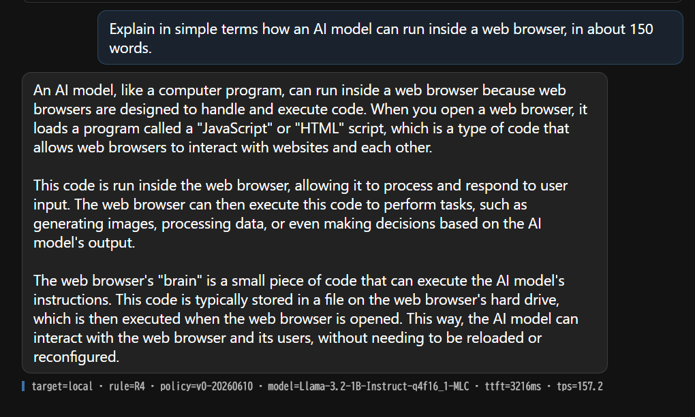
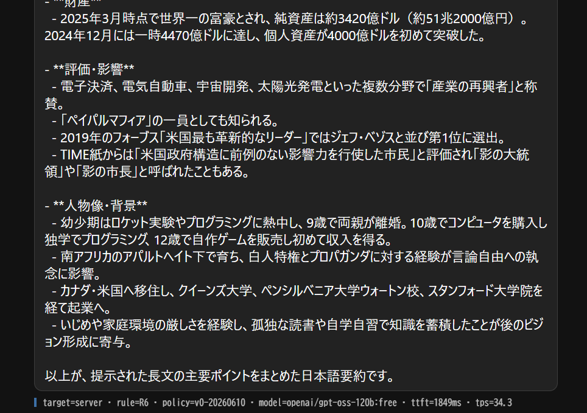
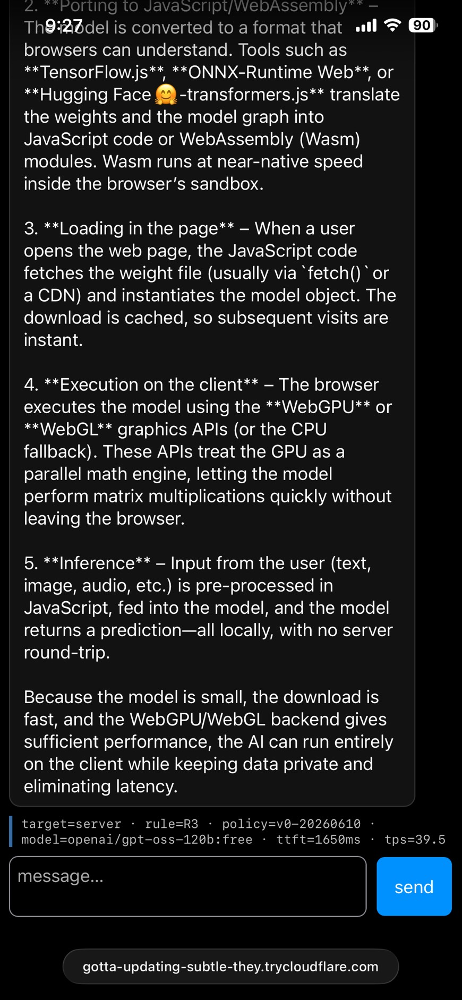

# ludion

**A load balancer between your users' GPUs and your cloud.**

Per-request routing of AI inference — on-device (WebGPU) when the device can,
server when it can't — decided by a versioned, deterministic, empirically
derived policy.

[](https://github.com/Ludion-ai/Ludion/actions/workflows/ci.yml)
[](https://www.npmjs.com/package/ludion-router)
[](LICENSE)

The same app, three environments — each response carries its routing decision:

| desktop → `local` (R4) | desktop, long CJK prompt → `server` (R6) | iPhone → `server` (R3) |
|---|---|---|
|  |  |  |

## Quickstart

```bash
npm install ludion-router
```

Zero config, zero keys — local-only mode:

```ts
const ludion = await Ludion.create();
const stream = await ludion.chat.completions.create({ messages, stream: true });
for await (const chunk of stream) { /* ran on the user's GPU */ }
```

With no `fallback`, anything the policy routes to a server throws a typed
`LudionNoFallbackConfigured` instead of silently failing — on a WebGPU desktop,
the request above runs entirely on-device.

To complete server-routed requests too, add a fallback. The endpoint is a
small relay **you** host, so the API key stays in your server's environment —
never in client code:

```ts
import { Ludion } from "ludion-router";

const ludion = await Ludion.create({
  fallback: {
    url: "/api/chat", // your relay proxy → your LLM provider (key server-side)
    model: "your-server-model",
  },
});

const stream = await ludion.chat.completions.create({
  messages: [{ role: "user", content: "Hello!" }],
  max_tokens: 256,
  stream: true,
});

let text = "";
for await (const chunk of stream) text += chunk.choices[0]?.delta?.content ?? "";

console.log(stream._ludion); // the decision log: target, rule_id, policy_version, ttft_ms, tps, ...
```

The relay is ~15 lines: copy one from [`docs/recipes/`](docs/recipes/)
(Next.js route handler, Cloudflare Worker, or Express), or clone the
[`examples/next-starter/`](examples/next-starter/) template where it's already
wired up. Any OpenAI-compatible `/chat/completions` URL works as `fallback.url`
as long as the browser can reach it (CORS — same-origin relays sidestep this
entirely).

The call shape is plain OpenAI. The only ludion-specific piece is `_ludion`,
the per-request decision log telling you where the request ran and which policy
rule decided it.

## The routing policy (and its evidence)

<!-- gen:policy-table -->
Policy `v0-20260610` (default max_tokens 256). Rules evaluate top-down; first hardware+request match wins. Full rationales live in [`router/src/policy.v0.json`](https://github.com/Ludion-ai/Ludion/blob/main/router/src/policy.v0.json).

| rule | target | hardware condition | request condition | privacy-eligible | rationale (first sentence) |
|---|---|---|---|---|---|
| R1 | server | env=webview-iab | any | no | In-app browsers stall/kill local inference regardless of hardware (LINE IAB, Pixel 8a 2026-06-10). |
| R2 | server | webgpu=false | any | no | No WebGPU → no local path (WebLLM is WebGPU-only). |
| R3 | server | os_class=ios-webkit | any | no | 0 successful iOS rows in Gate 0. |
| R4 | local | os_class=desktop, webgpu=true | est_prompt_tokens ≤ 3000 | yes | Desktop WebGPU: 121-196 tps decode, prefill ~2.6k tps (Gate 0). |
| R5 | local | os_class=android-chromium, webgpu=true | est_prompt_tokens ≤ 200, max_tokens ≤ 256, stream=true | yes | Pixel 8a: decode ~10 tps OK, prefill ~15 tps → long context unusable (77s TTFT @1.2k tok). |
| R6 | server | any | any | no | Default: unknown territory routes safe. |
<!-- /gen:policy-table -->

No other router ships its evidence: every rationale above cites the measurement
that produced the rule. The full dataset and analysis live in the
[measurement report](docs/report/2026-06-browser-inference-field-notes.md).

## Why this exists

Browser inference engines are commoditized (WebLLM, Transformers.js, wllama all
run the same weights), but the environments they run in are fragmented: Chrome's
built-in AI is desktop-only, iOS WebKit kills tabs without an error, in-app
browsers report full WebGPU capability while being non-viable. The same model on
the same hardware varies several-fold by engine, and a capability probe cannot
predict any of it. The variance is the product: routing has to be measured, not
assumed.

<!-- gen:readme-evidence -->
Policy v0 is derived from **48 archived benchmark runs** across **4 device/environment configurations** (desktop-chrome, iphone-11-pro-max, pixel-8a, pixel-8a-line-iab), collected with [`bench/`](bench/) and archived byte-for-byte in [`bench/results/`](bench/results/). The aggregate is regenerated by script — no number in this README or the report is hand-typed.
<!-- /gen:readme-evidence -->

## Contribute a device row — two clicks

The routing table is only as good as its device coverage, and current coverage
is honest but thin: one device per class, Mali-only Android, no Adreno, no
8 GB-RAM iPhone, no warm-cache mobile rows.

Open the live bench *(deploying)* on the device → **Measure this device** →
**Submit result**. That's the whole contribution: the plan is auto-selected
from the device probe, and submissions join the public dataset
([CC0](bench/results/DATA_LICENSE)). Failed runs are first-class data — if the
tab dies mid-bench, reopen the page and Submit is still there with the failure
rows intact (those are routing data).

Curated submissions land in [`bench/results/`](bench/results/) with
`"source": "web-submission"` provenance, and CI regenerates every table in the
README and report directly from the archived JSONs — your row becomes part of
the policy's evidence base. (Air-gapped or exotic setup? A PR adding your
downloaded JSON to `bench/results/` still works — naming convention in
[`bench/results/README.md`](bench/results/README.md).)

## Limitations (read before depending on this)

- **Local engine = WebLLM only.** No engine choice yet, although the bench data
  shows engine choice matters.
- **Fallback = bring-your-own OpenAI-compatible endpoint** (optional since
  0.1.1 — without one, server-routed requests throw a typed error). The
  browser calls it directly, so it must allow CORS from your origin; the
  intended shape is a small relay you host ([`docs/recipes/`](docs/recipes/))
  with the provider key in server-side env, never in client code.
- **Policy v0 is a 2-point interpolation in places** (e.g. the Android prompt
  threshold sits between two measured points; the region between is unmeasured).
- **Not production-hardened.** v0.1.0 is a measured starting point, not a
  battle-tested router.

## License

[MIT](LICENSE). © 2026 Ludion-ai.
