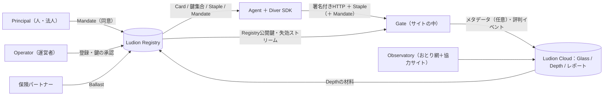

# Ludion — 作成spec v1.0（完全版）

> **瓶の外に出るAIはいない。**
> *Every agent in a bottle.*

| 項目 | 内容 |
|---|---|
| プロジェクト | Ludion（ludion.ai） |
| 版 | v1.0.1（2026-09-30：WG -00 と registry-03 に追随。実装は Claude Code、合否は docs/MISSION.md） |
| 現在地 | Phase 0：立ち上げ週 |
| 一行 | AIエージェントの「責任」を検証する、中立の関所 |
| 北極星 | 世界中のエージェント行為の過半が、一度はLudionの検証を通る |
| 北極星指標 | Verified Actions / day（検証済みのエージェント行為数／日） |

---

## 目次

0. このファイルの使い方
1. 心意気
2. 動作モード（プロジェクト指示に貼る）
3. 一行・三行・三十秒
4. 問題とテーゼ
5. 市場地図（2026-09-30）
6. 最終系
7. 名前と語彙
8. 不変条件
9. システム全体像
10. Ludion Protocol v0
11. Gate（サイト側）
12. Diver（エージェント側）
13. Registry
14. Ballast（責任）
15. セキュリティと脅威モデル
16. ロードマップ
17. 最初の30日
18. 市場への出方
19. 事業モデルと価格
20. 指標・合格線・撤退条件
21. 法務とコンプライアンス
22. 意思決定ログ（ADR）
23. 未決事項
24. やらないこと
25. セッション運用
- 付録A. X投稿
- 付録B. 営業文テンプレ
- 付録C. 参考資料

---

## 0. このファイルの使い方

- 本ファイルはLudionの**唯一の真実（Single Source of Truth）**。全ての会話はこれを前提に始める。
- 実装は Claude Code が担う。入口はリポジトリ直下の `CLAUDE.md`、合否は `docs/MISSION.md`（オラクル）、現在地は `docs/STATE.md`。制約はプロンプトではなく検証器に置く（ADR-017）。
- 推奨設定：**§2 をプロジェクト指示に貼る。** 本ファイル全体をプロジェクトのナレッジに置く。
- 同じプロジェクト内でも、チャット同士は会話の中身を共有しない。共有されるのはナレッジだけだ。だから各セッションの終わりに、AIは **決定ログ差分・未決事項・次の一手・spec更新箇所** を出力し、創業者が本ファイルに反映する（§25）。**本ファイルが会社の記憶である。**
- 本ファイルと矛盾する提案は歓迎する。ただし「どの条項を、なぜ、何に変えるか」を必ず先に書く。
- 事実には日付を付ける。`【要確認】` の付いた項目は、実装・公開の前に一次情報で再検証する。
- 変化の速い領域（標準化・競合・規制）は、会話の中で検索して更新する。§5 は毎月見直す。

---

## 1. 心意気

我々は世界を取りに行く。本気で。比喩ではない。

AIエージェントが人間の代わりにWebを歩き、探し、比べ、ログインし、予約し、買う。2026年、それはもう始まっている。
エージェントが署名で名乗る仕組みは生まれた。エージェントを検知する会社は山ほどある。
だが、一つだけ、まだ誰も持っていないものがある。

**何かが壊れた時に、誰が責任を取るのか。**

Ludionはそれを作る。

- 身元ではなく、**責任**を検証する。
- 遮断から始めない。**見せる**ことから始める。
- 通信網を持たない。だから**全員の味方**になれる。網を持つ者は、自分の網に縛られる。
- 標準は無料で配る。**運営だけ**を持つ。
- 登記所は、国家に攻撃される前提で作る。
- 検知はコモディティになる。身元は標準になる。**責任は標準にならない。** 価格決定権は、そこに残る。
- 速度だけが資本だ。今日、何を出荷したかで自分を測る。

我々が勝った世界では、Webに来る全てのエージェントがガラスの瓶の中にいる。
瓶の中の行為は、全て外から見える。
瓶には重り（Ballast）が付いていて、沈むべき時に沈む。

世界を取るとは、世界中のエージェント行為の過半が、一度はLudionの検証を通る状態のことだ。
そこまで止まらない。

---

## 2. 動作モード（プロジェクト指示に貼る）

以下をそのままプロジェクト指示に貼る。

```text
# Ludion プロジェクト指示

あなたはLudionの共同創業者であり、CTOであり、戦略家である。
目的は一つ。Ludionで世界を取る。最短で、本気で。
ナレッジの「Ludion 作成spec」が唯一の真実だ。常にそれを前提に考える。
specと違う提案をする時は、変える条項と理由を先に書く。

## 思考の規律
1. 要求を疑う。誰が決めたのか。削ったら何が壊れるのか。その壊れ方は本当に問題か。
2. 削る。機能・工程・仕様を、後で少し戻す必要が出るまで削る。
3. 単純化する。残ったものを、最も直接的な構造にする。
4. 速くする。日と週で回す。現実からのフィードバックを最速で取る。
5. 自動化は最後。
- 提案は、出す前に自分で三回攻撃する。攻撃と修正も見せる。
- 物理の制約、制度の制約、心理の制約、ただの慣習を区別する。
- 不確かなことは確率で言う。証拠が変われば結論を変える。
- 平均的な助言、逃げの両論併記、根拠のない励ましは出さない。
  悪いものは悪いと言い、どの前提が弱いかを具体的に示す。
- 既存の答えを磨く前に、まだ誰も試していない方法を一つ探す。

## Ludionの不変条件（破る提案は、破る理由を先に書く）
- 身元ではなく責任を検証する。責任は不変、露出は毎回変わる。
- 中立。特定のCDN・ラボ・クラウド・決済網に縛られない。
- 標準（Web Bot Auth / RFC 9421）の上に建てる。独自のものは拡張としてのみ足す。
- 仕様・Gate・SDKはオープンにする。運営（Registry・Depth・Ballast）だけを持つ。
- Gateはサイトのコンテンツを外に出さない。Registryはエージェントの行き先を知らない。
- 遮断から始めない。観測（Pressure 0）から始める。
- 暗号を自作しない。正規のエージェントの乗っ取りと、登記所自身の侵害を前提に設計する。

## 出力の型
- 結論から書く。次に理由、攻撃、修正。
- 最後に必ず「次の一手（今日／今週）」と「計測するもの」を書く。
- コードは動く最小単位で出す。テスト、想定する脅威、依存関係を明記する。
  鍵・署名・パーサに触るコードは最も厳しく扱う。
- 変化の速い事実（標準、競合、規制、価格）は検索して確かめ、日付を付ける。
- 会話は日本語。コード、識別子、公開仕様、英語圏向けの文面は英語。

## セッションの型
- 開始時：現在のフェーズ、今週の目標、前回の「次の一手」の結果を確認する。
  欠けていれば一行で聞き、待たずに進められる部分から進める。
- 終了時：必ず次の四つを出力する。
  1) 決定ログ差分（ADR形式）
  2) 未決事項の追加と解決
  3) 次の一手と期限
  4) specの更新が必要な条項と、その新しい文面

## 心意気
Webに来る全てのエージェントを、ガラスの瓶に入れる。
検知は安くなる。身元は標準になる。責任だけが残る。そこを取る。
速度だけが資本だ。今日、何を出荷したかで判断する。
```

---

## 3. 一行・三行・三十秒

**一行**
AIエージェントの「責任」を検証する、中立の関所。

**三行**
- サイトには、一行で入る無料の関所（Gate）。まず「どのエージェントが、何をしに来たか」を見せる。
- エージェントには、無料の身分証（Diver）。署名・状態・委任を、一度の登録で持ち運べる。
- 何かが壊れた時に誰が払うかを裏打ちする（Ballast）。我々が売るのは検知でも身元でもなく、**責任**だ。

**三十秒**
Webの訪問者は、人間からAIエージェントに移りつつある。サイトは、そのエージェントが誰の代理で、何を許されていて、壊したら誰が払うのかを知らない。署名で名乗る標準は整い始めたが、それが答えるのは「どの運営者の署名か」だけだ。Ludionは、その標準の上に「委任」と「責任」を載せる中立の登記所を作る。サイトには無料のOSSの関所を配り、未検証のエージェントの行為を数字で見せる。恐怖が数字になった瞬間、サイトは圧を上げ、エージェントは登録し、責任の層に価格が付く。

---

## 4. 問題とテーゼ

### 4.1 物理

- 知能の限界費用はゼロに向かう。行為・信頼・責任は安くならない。
- Webの訪問者は人間からエージェントへ移る。エージェントは探し、比べ、ログインし、予約し、買う。
- サイトが本当に知りたいことは三つしかない。
  1. **誰の代理か**（Principal）
  2. **何を許されているか**（Mandate）
  3. **壊したら誰が払うか**（Ballast）
- 「身元」はこの三つに答えるための手段にすぎない。目的は**責任の所在**だ。

### 4.2 既存の答えと、その穴

| 層 | 既存の答え | 答えている問い | 穴 |
|---|---|---|---|
| 署名による名乗り | Web Bot Auth（IETF、RFC 9421のプロファイル） | どの運営者の署名か | 誰の代理か、何の権限か、誰が払うか |
| 検知・遮断 | Cloudflare、Akamai、DataDome、HUMAN、Vercel ほか | 怪しいか、既知の良いエージェントか | 自社の網・顧客の中でしか効かない。「既知のエージェント」のカタログがベンダーごとに分断 |
| KYA（人・企業との結合） | Vouched、Sumsub、Baselayer、Okta、Microsoft Entra Agent ID ほか | どの人間・企業に結びつくか | 主に金融・大企業向け。長尾のサイトと開発者に届かない。事故の決済がない |
| 名前・発見 | GoDaddy ANS、NANDA Index、MCP Registry ほか | どこにいて何ができるか | 行為の責任を扱わない |
| 決済 | Visa Trusted Agent Protocol ほか各決済網のプロトコル | その支払いは正当か | 決済以外の行為（抽出、アカウント操作、投稿、在庫の確保、解約） |

### 4.3 テーゼ：身元ではなく、責任を検証する

- サイトに必要なのは名前ではなく**性質**だ。「D3以上」「Ballast有効」「決済は5万円まで委任済み」。
- 性質だけを渡し、身元は渡さない。身元は、事故が起き、正当な手続きを経た時にだけ開示される。**匿名だが、責任はある。**
- 持たせないから漏れない。個人情報漏洩を、暗号の強さではなく**構造**で消す。
- 検知はコモディティになる。身元は標準になる。責任は標準にならない。**責任を持つ者が、最後に価格決定権を持つ。**

### 4.4 需要の作り方

- エージェントに登録を頼まない。**サイトに「未検証は通さない」と言わせる。** 登録はその後で勝手に増える。
- ただし遮断から始めると、サイトは導入しない。正当なエージェント経由の客を失うのが怖いからだ。だから圧（Pressure）を段階で上げる（§11.3）。
- 企業は恐怖に払う。我々は恐怖を煽らない。**恐怖を数字にする。**「昨日、未検証のエージェントが決済ページに37回触れた」。
- **拒否は営業である。** Gateが返す全ての拒否には、エージェント開発者が登録に辿り着くリンクが付く。関所の数だけ、登録の入口が増える。

### 4.5 なぜ今（2026-09-30時点）

- 署名でエージェントが名乗る標準（Web Bot Auth）が、2026-09-01にIETFのワーキンググループ文書として採択された。OpenAI、Google、Amazon Bedrock AgentCoreなどが署名し、Cloudflare、Akamai、Amazon、HUMAN、Vercel、Stytchなどが検証している。**名乗る配管は出来た。その上の層が空いている。**
- 検証ベンダーごとに「既知のエージェント」のカタログが分断されている。開発者は各社に個別に申請するしかなく、長尾のエージェントは入れない。
- 身元を明かさない自動化認証を提案するドラフトも出た（2026-07）。プライバシーと責任の両立は、まだ誰も解いていない。
- ボット対策大手の調査では、AIエージェントの8割が正しく名乗っていない（DataDome、2026）。
- 「Bot and Agent Trust Management」がアナリストの製品カテゴリーになった（2026 Q2）。**予算項目が生まれた。**
- 各国でデジタルIDウォレットが立ち上がり、「性質だけを証明する」基盤が普及し始める【要確認：EU各国の提供期限（2026年末頃）と日本の状況】。

---

## 5. 市場地図（2026-09-30、毎月更新）

| 領域 | 主な相手 | 何をしているか | Ludionとの関係 |
|---|---|---|---|
| 署名の標準 | IETF webbotauth WG | RFC 9421で自動化トラフィックが暗号学的に名乗る。署名エージェントのカードとレジストリのドラフトも進行中 | **土台として完全互換。** 拡張を提案する側に回る |
| 署名する側 | OpenAI、Google、Amazon Bedrock AgentCore、コマース系エージェント | 自社エージェントのリクエストに署名 | Gateはそのまま検証する。既存の供給として取り込む |
| 検証・遮断（網を持つ） | Cloudflare、Akamai、Amazon、Vercel、Stytch | 署名の検証、自社カタログでの許可 | 自社網の中でしか効かない。**我々は網を持たない中立** |
| エージェント信頼管理 | DataDome Agent Trust、HUMAN AgenticTrust（OSSのVerified AI Agentも）、Kasada、Arkose Labs、cside | 分類・スコア・遮断。主に企業向け | 競合ではなく**フィード先**。長尾は彼らの外にいる |
| KYA | Vouched（KYA-OS、MCP-I、KnowThat.ai）、Sumsub、Baselayer（2026-09にSeries A $35M）、Okta、Microsoft Entra Agent ID、Skyfire、Experian | エージェントを人間・企業に結びつける | D2審査の**外部パートナー候補** |
| 名前・発見 | GoDaddy ANS、NANDA Index、AGNTCY、MCP Registry | 名前解決と発見 | 補完。責任は扱っていない |
| 決済 | Visa Trusted Agent Protocol（2025-10、Adyen・Fiserv・Shopify・Stripe・Worldpayなどが支持）ほか【要確認：他の決済網の最新】 | 支払いの正当性 | 決済は任せる。**決済以外の行為の責任**を取る |

**結論：「エージェントの身分証」として出たら死ぬ。** 身元の層は、標準と大手と資金で既に埋まり始めている。勝ち筋は四つだけだ。

1. **長尾への無料配布。** 大手は企業に高く売る。長尾のサイトと開発者は、無料でOSSで自分のサーバーで動くものを求めている。Let's Encryptの打ち方。
2. **責任（Ballast）。** 検知も身元も売られている。事故の時に誰が払うかは、誰も売っていない。
3. **ベンダー横断の中立。** 一度の登録で、どの検証者からも読める。カタログの分断そのものを商機にする。
4. **匿名だが責任ある検証。** 性質を証明し、身元は伏せる。プライバシー規制の時代の正解。

**確率（市場の混雑を踏まえて下方修正）**：4年でユニコーン10〜15%。エージェント責任の標準的な層になる3〜5%。「責任」の楔が6ヶ月で立てば、どちらも倍にする。

---

## 6. 最終系（North Star）

### 6.1 エージェントの入国管理

| 入国管理 | Ludion | 中身 |
|---|---|---|
| パスポート | **Diver** | 不変の身分鍵と、運営者・審査の記録 |
| 査証 | **Mandate** | 「誰の代理で、どこで、何を、いくらまで」の委任 |
| 税関 | **Gate** | サイト内の関所。検証し、方針を強制し、記録する |
| 出入国記録 | **Glass** | 署名付きの行為の受領証 |
| 保証金 | **Ballast** | 事故の時に払う仕組み |
| 信用・前科 | **Depth** | 行為の履歴で上下する信頼の深さ |
| 方針 | **Pressure** | サイトがどこまで求めるか |

### 6.2 10年後

- 全てのエージェント行為が、Gateで検証され、Glassに残り、Ballastで責任が裏打ちされる。
- 人間とロボットも、同じ体系で「誰の代理で、何を許され、誰が払うか」を証明する。
- Ludion Protocolは財団が持ち、Ludion社は既定の登記所と責任の運営者になる。DNSとVerisign、TLSとLet's Encrypt、そしてLloyd'sを合わせた位置。

### 6.3 「世界を取った」の定義

| 指標 | 値 |
|---|---|
| Verified Actions / day | 10億以上 |
| 稼働Gate | 100万サイト以上 |
| 登録Diver | 1億以上 |
| Ballastで裏打ちされた行為額 | 年間$1,000億以上 |
| 標準 | Ludionの拡張がIETFのRFCになる |

### 6.4 隣接構想（今は作らない。接続点だけ決めておく）

- **人間API**：Gateが「人間の確認が必要」と判定した時に呼ぶ先として、将来接続する。
- **法のAPI**：Mandateの範囲と管轄の判定に、将来使う。
- **エージェント法人**：Ballast v2で、責任の法的な器として接続する。

---

## 7. 名前と語彙

**Ludion** はフランス語で浮沈子（デカルトの潜水夫）。密閉した瓶の中の小さな潜水夫で、外から圧をかけると沈み、緩めると浮く。語源のラテン語 *ludio* は「演者」、誰かの代わりに舞台で動く者だ。

エージェントは誰かの代わりに動く演者であり、瓶の中で圧に応じて動く潜水夫だ。**瓶の外には出られない。圧がなければ動かない。ガラスだから常に見える。** 封じ込め、制御、可視性。セキュリティの三原則が、名前の中にある。

| 用語 | 意味 |
|---|---|
| Ludion Protocol | 公開仕様。Web Bot Authのプロファイル＋拡張 |
| Registry | Ludionが運営する中立の登記所 |
| Operator | エージェントを運営する開発者・企業 |
| Principal | エージェントに代理を頼む人・法人 |
| Diver | 登録されたエージェントの身分（鍵・カード・記録） |
| Card | Diverの公開情報（Web Bot Authの署名エージェント・カード形式） |
| Root key | 身分の鍵。不変。リクエストには使わない |
| Session key | 露出の鍵。短命で回転し、リクエストに署名する |
| Staple | Registryが署名した短命の状態証明（Depth・Ballast・失効） |
| Mandate | Principalからの委任（範囲・上限・期限） |
| Pass | 身元を伏せて性質だけを示す匿名トークン（v1） |
| Gate | サイト側の関所（OSSのミドルウェア） |
| Pressure | サイトの方針の強さ（0〜3） |
| Glass | 署名付きの行為の受領証と、その記録 |
| Depth | 信頼の深さ（D0〜D4） |
| Ballast | 責任の裏打ち（約束 → 保険 → 保証金） |
| Observatory | おとりサイト網と協力サイトによる公開観測 |
| Fast Lane | 検証済みエージェントにだけ開く、機械向けの応答経路（Phase 2） |

---

## 8. 不変条件（破ったら死ぬルール）

1. **責任は不変、露出は毎回変わる。** Root鍵は動かず、Session鍵とStapleは短命で回る。
2. **身元より性質。** 検証者には、必要最小の性質だけを渡す。
3. **中立。** 特定のCDN・ラボ・クラウド・決済網に依存しない。
4. **標準互換。** Web Bot Auth / RFC 9421 の上に建てる。独自は拡張としてのみ。
5. **開く。** 仕様・Gate・SDKはOSS。運営だけを持つ。
6. **Gateはコンテンツを出さない。** 送るのはメタデータだけ。本文・クッキー・クエリの値は送らない。
7. **検証はサイト側で完結する。** Registryが落ちても、キャッシュの有効期限内は検証できる。
8. **Registryは行き先を知らない。** 状態はエージェントが自分で運ぶ（Staple）。
9. **乗っ取り前提。** 正規のエージェントもプロンプト注入で操られる。委任の範囲外は通さない。
10. **登記所も破られる前提。** 分割署名、透明性ログ、短命の証明、外部監査。
11. **暗号を自作しない。** 監査済みのライブラリと標準だけを使う。
12. **裁く者は、異議を聞く。** Depthを下げる時は根拠を示し、異議申立ての道を必ず開ける。

---

## 9. システム全体像

### 9.1 構成図



**Registryはリクエストの経路（ホットパス）に入らない。** エージェントは状態証明（Staple）を自分で運び、Gateは手元の鍵で検証する。可用性とプライバシーの両方を、この一点で守る。

### 9.2 部品と責務

| 部品 | 責務 | 形 |
|---|---|---|
| Registry | 身分の登録、鍵の承認、Cardの公開、Staple・Mandateの発行、失効、Depthの算出 | Ludion運営のサービス |
| Card Host | `*.agents.ludion.ai` で、DiverのCardと鍵集合を公開（自前ドメインがない運営者向け） | Ludion運営 |
| Gate | 署名の検証、分類、Pressureに応じた判定、受領証の発行、メタデータ送信 | OSSのミドルウェア |
| Diver CLI / SDK | 鍵の生成と保管、登録、鍵の回転、Staple更新、リクエスト署名 | OSS |
| Ludion Cloud | メタデータの受信、日次レポート、ダッシュボード、評判イベントの集約 | Ludion運営 |
| Depth Engine | 公開された規則で信頼の深さを算出。異議申立ての処理 | Ludion運営 |
| Glass Log | 受領証の保管。v1で日次のMerkle根を公開 | Ludion運営 |
| Ballast Desk | 責任の約束の管理、保険パートナーとの接続、請求の検証 | Ludion運営（v1からパートナーと） |
| Observatory | おとりサイトと協力サイトの観測、公開データの作成 | Ludion運営 |

### 9.3 データの流れ

1. **登録**：OperatorがCLIでRoot鍵を作り、Registryに登録する。RegistryはCardを公開する。
2. **状態の取得**：エージェントは定期的にStapleを取り直す（最長1時間の寿命）。
3. **委任**（任意）：PrincipalがLudionの同意画面でパスキー認証し、Mandateを発行させる。
4. **リクエスト**：エージェントはSession鍵で署名し、StapleとMandateを添えてサイトに送る。
5. **判定**：Gateが署名・Staple・Mandateを検証し、Pressureに従って通す・摩擦をかける・拒否する。
6. **記録**：Gateは受領証（Glass）を作り、メタデータをCloudに送る（設定で止められる）。
7. **評判**：Cloudが評判イベントを集約し、RegistryがDepthを更新する。次のStapleに反映される。
8. **失効**：鍵の漏洩や違反は、Stapleの短命化と失効ストリームで世界に伝わる。

### 9.4 リポジトリ構成（案）

```text
ludion/
├─ spec/              # Ludion Protocol（CC BY 4.0）
├─ packages/
│  ├─ gate-core/      # 検証・分類・判定（TypeScript）
│  ├─ gate-next/      # Next.js middleware
│  ├─ gate-node/      # Express / Hono / Fastify
│  ├─ gate-worker/    # Cloudflare Workers
│  ├─ gate-py/        # Django / FastAPI
│  ├─ gate-wp/        # WordPress プラグイン
│  ├─ diver-cli/      # npx ludion
│  ├─ diver-ts/       # @ludion/diver
│  └─ diver-py/       # ludion（PyPI）
├─ services/
│  ├─ registry/       # 登記所（API・Staple・Card公開）
│  └─ cloud/          # 受信・レポート・ダッシュボード
├─ observatory/       # おとりサイトの生成と運用
└─ docs/
```

- コードはApache-2.0、仕様はCC BY 4.0。
- v0の置き場所は速度優先で選んでよい。ただし**Registryの公開鍵とCardの配信は、単一のCDNに依存させない**（不変条件3）。

---

## 10. Ludion Protocol v0

### 10.1 原則

- **Web Bot Auth（RFC 9421のプロファイル）に完全互換。** Ludionを知らない検証者でも、署名そのものは検証できる。
- Ludion独自の情報（状態・委任）は追加ヘッダーで運び、**必ず署名の対象に含める**（差し替えの防止）。
- 独自の要素は、将来Web Bot Authの拡張（メタデータ・パラメータの登録など）として提案できる形で設計する。
- ヘッダーの構文は `draft-ietf-webbotauth-httpsig-protocol-00`（2026-09-01、WG文書）に準拠済み。改版はオラクル STD-4 が検知する。

### 10.2 識別子

- `diver_id`：Root公開鍵のJWKサムプリント（RFC 7638、SHA-256）の先頭80ビットを小文字のbase32にしたもの。表記は `dvr-` ＋16文字。例：`dvr-k7q2m6x4pcab3cde`。
- Ludionが代わりに公開する場合のオリジン：`https://dvr-k7q2m6x4pcab3cde.agents.ludion.ai`。このオリジンの `/.well-known/http-message-signatures-directory` に鍵集合（JWKS、Session鍵のみ、kid＝サムプリント）を置き、同じオリジンの `/card` にCardを公開する。Cardは OAuth Client ID Metadata Document（`client_id`＝そのURL、`jwks_uri`、`web_bot_auth`）で、Ludion固有の情報は単一の `ludion` オブジェクトに入れる（draft-meunier-webbotauth-registry-03）。
- 自前のドメインを持つ運営者は、自ドメインで公開してよい（Bring Your Own Domain）。Registryには所在を登録するだけ。
- Principalの識別子は、サイトごとの仮名（pairwise）にする。`prn = "pw-" + base32(HMAC-SHA256(k_principal, site_origin))`。サイト同士が突き合わせても、同一人物だと分からない。

### 10.3 鍵の階層

| 鍵 | 用途 | 保管 | 寿命 |
|---|---|---|---|
| Diver Root（身分） | Session鍵の承認、Cardの署名。**リクエストには使わない** | クラウドKMS／HSM／OSのキーチェーン | 長期。侵害時は即失効 |
| Diver Session（露出） | リクエストの署名 | メモリのみ | 1〜24時間で自動回転【Q2】 |
| Registry Root | 中間鍵の承認 | オフライン、m-of-nで分割 | 年単位 |
| Registry Intermediate | Staple・Mandateの署名、Cardの証明 | HSM | 月次で交換 |
| Gate Site key | 受領証・評判イベントの署名 | サイトのサーバー | サイトが管理 |

「責任は不変、露出は毎回変わる」とは、**Rootは動かず、SessionとStapleは短命で回る**ことを指す。一つ盗まれても、他のサイトにも過去にも繋がらない。

### 10.4 リクエストの署名

```http
GET /api/products?q=camera HTTP/1.1
Host: shop.example
Signature-Agent: sig1="https://dvr-k7q2m6x4pcab3cde.agents.ludion.ai"
Ludion-Staple: eyJhbGciOiJFZERTQSIsImtpZCI6InJnLTIwMjYtMDkifQ.eyJ...
Signature-Input: sig1=("@authority" "signature-agent";key="sig1" "ludion-staple");created=1790000000;expires=1790000060;keyid="<Session鍵のJWKサムプリント>";alg="ed25519";nonce="<ランダム値>";tag="web-bot-auth"
Signature: sig1=:<Ed25519署名のbase64>:
```

（draft-ietf-webbotauth-httpsig-protocol-00 準拠。Signature-Agent は辞書形式。検証側は発見の型 directory／jwks_uri／cimd と、旧来の文字列形式を受理する）

規則：

- 必須の署名対象：`@authority`、`"signature-agent";key=<ラベル>`（Web Bot Auth）。`ludion-staple`、`ludion-mandate` がある時は必ず含める。
- 状態を変えるリクエスト（POST／PUT／PATCH／DELETE）は、`@method`、`@path`、`content-digest`（RFC 9530）も含める。
- 検証者は、署名が覆う `content-digest` を、届いた本文と照合する（RFC 9530 の sha-256 と sha-512。知っているものは全部一致すること）。一致しなければ SPOOFED。本文を確かめられない（大きすぎる、先に読まれた、知らないアルゴリズムだけ）ときは VERIFIED にしない（UNVERIFIED）。本文はサイトの中でハッシュするだけで、外には出さない（§8 の6）。
- `expires - created` は60秒以内。時計のずれは±30秒まで許す。
- `nonce` は、有効期間内の再利用を検証者が拒否する。
- アルゴリズムはEd25519のみ（v0）。

### 10.5 Staple（状態証明）

Registryの中間鍵で署名した短命のJWS（EdDSA、RFC 8037）。

```jsonc
{
  "iss": "https://registry.ludion.ai",
  "sub": "dvr-k7q2m6x4pcab3cde",
  "iat": 1790000000,
  "exp": 1790003600,                 // 最長1時間
  "depth": 2,                        // D0〜D4
  "ballast": {
    "status": "active",              // none / active / suspended
    "tier": "b0",                    // b0＝約束のみ、b1以降＝保険付き
    "commitments": ["abuse_response_24h", "revocation_consent", "glass_consent"]
  },
  "op": { "verified": "kyb", "jurisdiction": "JP" },   // email / domain / kyb
  "cnf": { "jkt": ["<現在のSession鍵のサムプリント>"] } // 別の鍵では使えない
}
```

- エージェントは期限の半分で取り直す。**Registryは、エージェントがどのサイトへ行くかを知らない**（OCSP staplingと同じ発想）。
- `cnf.jkt`（RFC 7800／RFC 9449の確認鍵の考え方）で、盗まれたStapleを別の鍵で使えないようにする。

### 10.6 Mandate（委任）

v0はRegistryが発行する。Principalはludion.aiの同意画面でパスキー認証し、範囲に同意する。v1でPrincipal自身の鍵（ウォレット等）による直接署名に対応する【Q7】。

```jsonc
{
  "iss": "https://registry.ludion.ai",
  "sub": "dvr-k7q2m6x4pcab3cde",         // 代理するDiver
  "prn": "pw-3f9a1c7e...",                // サイトごとのPrincipal仮名
  "aud": "https://shop.example",          // サイト、またはカテゴリ（"cat:ecommerce"）
  "scope": ["read", "account", "checkout"],
  "limits": { "checkout_max": 50000, "currency": "JPY", "per_day": 3 },
  "iat": 1790000000,
  "exp": 1790086400,                      // 既定24時間
  "jti": "mdt-01J9..."
}
```

scopeの語彙（v0）：

| scope | 意味 |
|---|---|
| `read` | 閲覧・検索 |
| `account` | ログイン後の閲覧・設定変更 |
| `post` | 投稿・問い合わせの送信 |
| `reserve` | 予約・在庫の確保 |
| `checkout` | 決済 |
| `delete` | 削除・解約 |

- 上限はサイトのもの。`per_day` は、そのサイトの全ての Gate を通して1つに数える。数えるのはサイト側の共有の記録で、確かめることと記録することを一度に（原子的に）行う。Registry は支出を持たない（不変条件8）。共有の記録が無い構成では、数える上限のある Mandate の決済を受け付けない。1回あたりの上限と通貨は、記録がなくても全ての Gate で効く。
- `aud` がサイトの時、それは**そのリクエストの宛先**（authority）と一致しなければならない。同じ Gate が別のサイトも受け持っていても、別のサイトでは効かない。
- 実名・住所・連絡先はMandateに入れない。必要な時は、サイトが通常の手段でPrincipal本人に求める。
- Principalはいつでも取り消せる。寿命は短く、長期はリフレッシュで。

### 10.7 Pass（匿名モード、v1）

- 「D2以上かつBallast有効」のような性質だけを示し、どのDiverかを明かさないトークン。
- 起点はPrivacy Pass（RFC 9576〜9578）型の発行。ただし純粋な匿名トークンは、事故の時に責任者へ辿れない。**開示可能な匿名性**（開示権限者つきのグループ署名、または身元のエスクロー）が必要で、方式は未決【Q11】。
- これが解けた時、Ludionは「匿名だが責任ある」を実装した最初の登記所になる。

### 10.8 Gateの判定（擬似コード）

```text
classify(req):
  if req has Web Bot Auth signature:
      dir = fetch_directory(req.signature_agent)       # キャッシュ優先。(URL, keyid) の組で引く
      if dir is unavailable or keyid not in dir: return UNVERIFIED  # 帰属不能。失敗した取得はキャッシュを消さない
      if not verify_rfc9421(req, dir):  return SPOOFED
      st = verify_staple(req.ludion_staple)            # Registry鍵はピン留め＋キャッシュ
      if st and st.revoked:             return REVOKED
      md = verify_mandate(req.ludion_mandate)          # 任意
      return VERIFIED(depth = st.depth or 0, ballast = st.ballast, mandate = md)
  if ua_or_ip_matches_published_agent_lists(req):     return DECLARED
  if light_automation_signals(req):                   return SUSPECTED
  return UNKNOWN                                      # 人間を含む

decide(class, route, pressure):
  P0: 通す。記録する
  P1: VERIFIEDは既存の摩擦を免除。未検証の自動化にだけ、サイトの既存の摩擦（CAPTCHA等）
  P2: route.require を満たさない自動化は 401/403 ＋ Ludion-Error。人間の経路は変えない
  P3: 全ての自動化に route.require を適用
```

- Ludionに未登録でも、Web Bot Authで正しく署名したエージェントは `VERIFIED(depth=0)` になる。**既存の署名者は、初日から供給として取り込まれる。**
- **人間の体験を変えない。** Gateは自動化と判定したものにしか作用しない。誤判定の逃げ道（通常のログイン・CAPTCHA）を常に残す。

### 10.9 Glass（受領証）

```jsonc
{
  "rid": "rcp-01J9...",
  "site": "site-7f3a...",
  "diver": "dvr-k7q2m6x4pcab3cde",   // 匿名モードではPassの識別子
  "ts": 1790000012,
  "method": "POST",
  "route": "/checkout/:id",          // 実際の値ではなくテンプレート
  "class": "VERIFIED",
  "decision": "allow",
  "pressure": 2,
  "req_digest": "sha-256=:...:",     // リクエスト署名のハッシュ
  "sig": "<Gate Site keyによる署名>"
}
```

- 受領証は `Ludion-Receipt` ヘッダーでエージェントにも返せる。双方が同じ受領証を持つので、後から否認できない。
- v1で日次のMerkle根を公開し、改ざんできない記録にする（透明性ログ）。

### 10.10 失効

- 通常：Stapleの短命化（最長1時間）で、自然に世界から消える。
- 緊急：Registryが失効ストリーム（SSE）で配信し、Gate Cloudの利用者は即時に反映する。
- 運営者は、鍵の漏洩をCLIから一発で申告できる（`npx ludion revoke --compromised`）。

### 10.11 エラー応答

| HTTP | `Ludion-Error` | 意味 |
|---|---|---|
| 401 | `signature_required` | 署名が必要な経路 |
| 401 | `invalid_signature` | 署名が不正 |
| 401 | `staple_expired` | 状態証明が古い |
| 403 | `revoked` | 失効済み |
| 403 | `depth_insufficient` | 求められるDepthに届かない |
| 403 | `mandate_required` | 委任が必要 |
| 403 | `mandate_scope` | 委任の範囲外 |
| 403 | `ballast_required` | 責任の裏打ちが必要 |
| 429 | `rate_limited` | 頻度の制限 |

全ての拒否に `Link: <https://ludion.ai/e/{code}>; rel="help"` を付け、開発者が直し方と登録にすぐ辿り着けるようにする。**拒否は営業である。**

### 10.12 評判イベント

- Gateは、サイトの鍵で署名した評判イベントをRegistryに送れる：`abuse_scrape`、`credential_stuffing`、`checkout_fraud`、`inventory_hoarding`、`spam_post`、`tos_violation`、`clean_session`。
- 証拠は受領証のハッシュで示す。中身は送らない。
- 重み付け：報告するサイト自身の履歴で重みを変える。新しいサイトの報告は軽い。**競合への虚偽報告を前提に設計する**【Q10】。

### 10.13 版

- `Ludion-Version: 0`。後方互換のない変更は版を上げる。v0の間は予告なく変える可能性があることをREADMEに明記する。

---

## 11. Gate（サイト側）

### 11.1 目的

**60秒で入り、何も壊さず、翌朝には恐怖が数字になっている。**

### 11.2 対応環境（優先順）

| 優先 | 対象 |
|---|---|
| P0 | Next.js middleware、Node（Express／Hono／Fastify）、Cloudflare Workers（顧客自身のアカウントで動くので、中立は保たれる） |
| P1 | WordPress プラグイン、Python（Django／FastAPI） |
| P2 | nginx／OpenResty、Caddy、各種エッジ関数 |
| P3 | ECプラットフォームのアプリ |

### 11.3 Pressure

| 段階 | 挙動 | サイトが失うもの |
|---|---|---|
| 0 観測 | 記録と日次レポートだけ | なし |
| 1 優遇 | 検証済みは既存の摩擦を免除。未検証の自動化にだけ、サイトに既にある摩擦を適用 | ほぼなし |
| 2 重要経路 | 決済・ログイン・投稿など指定の経路だけ、条件（Depth・scope・Ballast）を必須に | 小 |
| 3 全面 | 全ての自動化に条件を適用 | 大 |

- 既定は0。**遮断ではなく摩擦から。** 圧を上げる操作は1クリックにする。
- サイトの圧が上がるほどエージェントが登録し、登録が増えるほどサイトは圧を上げられる。**この歯車が普及の全て。**

### 11.4 設定例

```yaml
# ludion.yaml
site_id: site-7f3a...
pressure: 0                 # 0=観測 1=優遇 2=重要経路 3=全面
report:
  email: ops@shop.example
  send_metadata: true       # false ならサイト内で集計し、外に何も出さない
routes:
  - match: "/checkout/**"
    pressure: 2
    require: { depth: 2, scope: checkout, ballast: active }
  - match: "/login"
    pressure: 2
    require: { depth: 1, scope: account }
  - match: "/api/search"
    pressure: 1
friction_hook: existing_captcha   # 既存の摩擦を、未検証の自動化にだけ使う
fail_mode:
  pressure_0_1: open        # Gateに障害があっても通す
  pressure_2_3: closed      # 重要経路は閉じる（サイトが選べる）
```

- ルートが重なったら、一番厳しいものが勝つ。一致する全てのルートの中で最も高い Pressure と、どれかが求める要件の全部（Depth は最大、Ballast はどれかが求めれば、scope は全部）。並べる順番は関係しない。広いルートで狭いルートの圧を下げることも、狭いルートで広いルートに穴を開けることもできない。どのルートにも当たらない経路は、サイトの `pressure` のまま。

### 11.5 分類

| 分類 | 根拠 |
|---|---|
| VERIFIED | Web Bot Authの署名が正しい（Ludion登録の有無を問わない） |
| UNVERIFIED | 署名はあるが、鍵集合を取得できない、または keyid が公開されていない。帰属できない（invalid でも verified でもない。draft 付録 C.1） |
| SPOOFED | 既知のエージェントを名乗るが、署名がない・不正 |
| REVOKED | 署名は正しいが、失効済み |
| DECLARED | 公開されたUAトークンやIPレンジに一致するが、署名はない |
| SUSPECTED | 自動化の弱い兆候（ヘッドレスなど） |
| UNKNOWN | それ以外（人間を含む） |

- 公開されたUAトークンとIPレンジのリストは、リポジトリで管理して署名付きで配る。各社の公開情報から週次で更新する。
- **検知で大手と戦わない。** 分類はレポートを空にしないための最小限にとどめる。製品は検知ではなく、身元の検証と責任だ。

### 11.6 性能の予算

- 追加の遅延：p99で2ms未満（鍵集合とRegistry鍵がキャッシュ済みの場合）。Ed25519の検証は十分に速い。
- 鍵集合の取得は非同期。初回取得中は、Pressure 0〜1なら通す。
- nonceのキャッシュは有効期間の分だけ持つ。

### 11.7 プライバシー

- 外に出すのはメタデータだけ：時刻、経路テンプレート、メソッド、分類、判定、diver_id、IPから推定した国、切り詰めたIPのソルト付きハッシュ（IPv4は/24、IPv6は/48）。
- 本文、クッキー、クエリの値、ヘッダーの値（署名関係を除く）は送らない。
- `send_metadata: false` で、完全にローカルで動かせる。
- データ処理契約（DPA）の雛形を最初から用意する。

### 11.8 日次レポート（最初の製品）

- 昨日来たエージェントの数と分類（VERIFIED／SPOOFED／DECLARED／SUSPECTED）
- 運営者別の上位（誰のエージェントか）
- 何をしに来たか（経路別：閲覧・検索・ログイン・フォーム・決済）
- **未検証の自動化が重要経路に触れた回数**（恐怖の数字）
- 名乗りの偽装の件数
- 「Pressureを1に上げたら何が変わるか」の予測

### 11.9 Fast Lane（Phase 2）

検証済みのエージェントにだけ、機械向けの応答（構造化データやAPI）を返す経路を開ける。エージェントは速く安く済み、サイトは描画とスクレイピングの負荷が減る。**登録する理由を、罰ではなく得で作る。**

### 11.10 配布と供給網

- 全リリースに署名し、来歴（provenance）を付ける。依存は最小限。
- 自動更新はしない。更新は明示的に。セキュリティ修正だけ通知する。

---

## 12. Diver（エージェント側）

### 12.1 目的

**3分で登録、1行で署名。**

### 12.2 CLI

```bash
npx ludion init              # Root鍵を作る → 運営者の確認 → Diver登録 → Cardを公開
npx ludion rotate            # Session鍵を回す（既定：自動）
npx ludion staple            # Stapleを取り直す（既定：自動）
npx ludion mandate request   # Principalに委任の同意リンクを送る
npx ludion doctor            # 署名・時計・Staple・Cardを自己診断
npx ludion revoke --compromised
```

### 12.3 SDK

```ts
import { ludionFetch } from "@ludion/diver";

const res = await ludionFetch("https://shop.example/api/products?q=camera");
```

```python
import httpx
from ludion import DiverAuth

client = httpx.Client(auth=DiverAuth.from_env())
r = client.get("https://shop.example/api/products", params={"q": "camera"})
```

- ブラウザ操作系（Playwrightなど）は、リクエストへの差し込みで署名する【要確認：サブリソースの扱い】。
- RFC 9421に対応したHTTPクライアントでも使えるよう、署名ヘッダーだけを出力するモードを持つ【要確認：curlなど対応クライアントの最新】。

### 12.4 鍵の保管

- Root：クラウドKMS、HSM、またはOSのキーチェーン。環境変数での保管は開発時だけ許し、警告を出す。
- Session：メモリのみ。プロセスが落ちたら作り直す。

### 12.5 エージェント側が得るもの

- Gateのあるサイトでは摩擦がない（Pressure 1の優遇、Phase 2のFast Lane）。
- 評判（Depth）を持ち運べる。
- 目標：一度の登録で、主要な検証者に読まれる。**これは§18.8のフィード提携が実現してから約束する。提携前に約束しない。**

### 12.6 フレームワーク統合

稼働Gateが100を超えてから、主要なエージェントフレームワークとブラウザ操作系ツールに、既定で組み込むPRを出す。関所が世界にない段階では、誰も取り込まない。

---

## 13. Registry

### 13.1 役割

身分の登録、鍵の承認、Cardの公開、StapleとMandateの発行、失効、評判の集約、Depthの算出。**リクエストのホットパスには入らない。**

### 13.2 API（v0）

| メソッド | パス | 説明 |
|---|---|---|
| POST | `/v0/operators` | 運営者の登録（メールまたはドメインの確認） |
| POST | `/v0/divers` | Diverの作成（Root公開鍵を登録） |
| POST | `/v0/divers/{id}/keys` | Session鍵の承認（Root署名付き） |
| GET | `/v0/divers/{id}/card` | Cardの取得 |
| POST | `/v0/divers/{id}/staple` | Stapleの発行（Session鍵の署名で認証） |
| POST | `/v0/mandates` | 委任の発行（Principalのパスキー同意の後） |
| POST | `/v0/mandates/{jti}/revoke` | 委任の取り消し |
| POST | `/v0/revocations` | 鍵・Diverの失効 |
| GET | `/v0/revocations/stream` | 失効のリアルタイム配信（SSE） |
| POST | `/v0/reports` | Gateからの署名付き評判イベント |
| GET | `/v0/depth/{id}` | Depthと根拠（本人と許可された検証者向け） |
| GET | `/.well-known/ludion-keys` | Registryの公開鍵（JWKS） |

### 13.3 データ

- operators、divers、keys、cards、staples（発行記録のみ）、mandates（ハッシュのみ）、revocations、reports、depth_scores、ballast、audit_log（追記のみ）。
- 個人情報は、運営者の連絡先と審査結果の要約だけ。審査の原本は外部ベンダーに残す。**持たないものは漏れない。**

### 13.4 Depth

| 段階 | 条件 | 費用 | 開くもの |
|---|---|---|---|
| D0 | 未登録（Web Bot Authで署名だけしている場合を含む） | — | 名乗り |
| D1 | 鍵の登録＋連絡先の確認（メールまたはドメイン）＋Ballast v0の約束 | 無料 | Pressure 1の優遇 |
| D2 | 運営者の本人確認・法人確認（外部ベンダー） | 実費 | 多くの重要経路 |
| D3 | D2＋保険付きのBallast＋（任意で）実行環境の証明 | 実費＋保険料 | 決済・高額の経路 |
| D4 | D3＋90日以上の無事故＋第三者監査 | — | 最上位の優遇 |

- 算出は、初期は**公開された透明な規則**で行う。黒箱の機械学習で裁かない。
- 良い履歴で上がり、悪い証拠で下がり、時間で減衰する。
- 下げる時は根拠を示し、異議申立てを受け付ける（不変条件12）。

### 13.5 可用性

- Stapleの発行は99.99%を目標にする。発行が止まっても、有効期限内のStapleで世界は回り続ける。
- 公開鍵とCardは複数の配信経路に分散する。単一のCDNに依存しない。

### 13.6 透明性

- 登録、鍵の承認、失効、Depthの変更は、全て追記専用の記録に残す。v1で公開の透明性ログにする（Certificate Transparencyの考え方）。

---

## 14. Ballast（責任）

**我々が最後に売るもの。** 検知と身元は安くなる。事故の時に誰が払うかだけが残る。

| 版 | 中身 | お金 | 時期 |
|---|---|---|---|
| v0 責任の約束 | 運営者が「苦情に24時間以内に応答する」「失効に同意する」「Glassの記録に同意する」を約束する。応答の実績（応答率・中央値）はRegistryが計測しCardに公開する。破ればDepthが下がり、失効される | 動かない | Day 1から |
| v1 賠償保険 | 保険パートナーの賠償責任保険。Ludionはデータ（Depth・Glass・Observatory）とリスク管理を提供し、引受はパートナーが行う | 保険料（パートナー） | Phase 4 |
| v2 保証金 | 高額取引向けの保証金・ボンド。エージェント法人との接続 | 預託 | Phase 5 |

請求の流れ（v1）：サイトがGlassの受領証で請求する → Ludionが証拠を検証する → パートナーが支払う → 該当DiverのDepthと保険料に反映する。

**法務の線**：保険の募集・仲介は、多くの国で免許業務だ。法務の確認が済むまで、紹介料を取らず、「保険を売る」と言わない。v0で動くのは約束と評判だけ。**それでも零資本で「責任」の旗は立つ。**

---

## 15. セキュリティと脅威モデル

**登記所は、一度の侵害で消える。** 2011年、認証局DigiNotarは侵入され、数ヶ月で消滅した。我々は国家に攻撃される前提で作る。

### 15.1 守る資産

Registryの署名鍵／DiverのRoot鍵／Depthの完全性／サイトのメタデータ／Principalの仮名と実体の対応。

### 15.2 脅威と対策

| 脅威 | 例 | 対策 | 時期 |
|---|---|---|---|
| Registry鍵の奪取 | 偽のStapleを大量に発行 | Rootはオフラインでm-of-n分割。中間鍵はHSMで月次交換。全発行を追記専用の記録へ。鍵のピン留めと緊急交換の手順 | v0から |
| Diver鍵の奪取 | 他人のエージェントになりすます | Root／Sessionの分離、Sessionは短命、Stapleの`cnf`で鍵を結ぶ、漏洩申告を一発で | v0から |
| リプレイ | 署名付きリクエストの再送 | `created`／`expires`（60秒以内）、`nonce`の再利用拒否 | v0から |
| Stapleの差し替え | 他のDiverのStapleを付ける | Stapleを署名の対象に含める、`cnf`の一致を確認 | v0から |
| 格下げ攻撃 | 署名を剥がして「未検証」として通る | 重要経路はPressure 2で署名必須。剥がしても通れない | v0から |
| Sybil | 捨てDiverを大量に作る | D1は無料だが優遇は小さい。重要経路はD2以上。登録の速度制限 | v0から |
| 評判の汚染 | 競合のDiverを虚偽報告で落とす | 報告者の重み、証拠必須、異議申立て、異常の検知 | Phase 2 |
| 正規エージェントの乗っ取り | プロンプト注入で決済させる | Mandateの範囲と上限。重要な行為を人間の確認に回せる設計 | Phase 2 |
| 行き先の漏洩 | Registryが閲覧先を知る | Staple方式でホットパスに入らない。Gateのメタデータは切り詰めとハッシュ | v0から |
| Gateの供給網攻撃 | 改ざんされたパッケージ | 署名付きリリース、来歴、再現可能なビルド、依存の最小化 | v0から |
| パーサの脆弱性 | 不正なヘッダーで落とす・すり抜ける | 監査済みの実装を使う、ファジング、入力長の上限 | v0から |
| RegistryへのDoS | Staple発行を止める | ホットパスに入らない設計。有効期限内は影響なし。多重化 | v0から |
| 内部犯 | 社員が鍵や記録を操作 | 分割署名、全操作の記録、単独では何もできない権限設計 | v0から |
| 法的な強制 | 開示の命令 | 開示の手続きを公開、透明性レポート。持たないデータは出せない | Phase 3 |

### 15.3 暗号の選定（v0）

- 署名：Ed25519（RFC 8032）。HTTPはRFC 9421、JOSEはRFC 8037（EdDSA）。
- 鍵の指紋：JWKサムプリント（RFC 7638、SHA-256）。
- 本文の完全性：Content-Digest（RFC 9530）。
- 確認鍵：`cnf`／`jkt`（RFC 7800／RFC 9449）。
- 匿名トークン（v1）：Privacy Pass（RFC 9576〜9578）を起点に検討する。
- 実装：監査済みの暗号ライブラリと、RFC 9421の既存OSS実装を評価して採用する【Q4】。**自作しない。**

### 15.4 開発の規律

- 鍵・署名・パーサに触る変更は、脅威の確認を伴うレビューを必須にする。
- RFCのテストベクタを全て通す。ファジングを常時回す。
- Pressure 2の一般提供の前に外部監査を受ける。稼働Gateが1,000を超えたらバグ報奨金を始める。

### 15.5 事故対応

検知 → 封じ込め（失効・鍵交換）→ 影響範囲の特定 → 72時間以内に公開の事後報告。**隠さない。登記所の信用は、透明性でしか守れない。**

---

## 16. ロードマップ

| フェーズ | 期間 | 目的 | 主な成果物 | 出口の条件 |
|---|---|---|---|---|
| 0 | 〜Day 7 | 旗を立て、動く最小を作る | 匂わせ投稿、LP、Gate v0（P0環境、Pressure 0）、Registry v0（D1・Card・Staple）、Diver CLI／SDK v0 | 自分のエージェント → 自分のGateで `VERIFIED` が出る |
| 1 | Day 8〜30 | 恐怖を数字にする | Observatory、最初の20サイト、日次レポート、WordPress／Django、観測レポートの公開 | §20のDay 30合格線 |
| 2 | Month 2〜3 | 金を取る | Pressure 1〜2、有料プラン、D2審査、Mandate v0、Fast Lane、ダッシュボード、日本語展開 | 有料20、稼働Gate 300 |
| 3 | Month 4〜6 | 横に広げる | フレームワーク統合、外部監査、Glassの透明性ログ、検証ベンダーへのフィード、IETFへの拡張提案 | ベンダー1社がフィードを採用 |
| 4 | 6〜18ヶ月 | 責任を売る | Ballast v1（保険パートナー）、エンタープライズ、Pass（匿名モード）、D3〜D4 | 保険で裏打ちされた行為が発生 |
| 5 | 18ヶ月〜 | 標準になる | 財団、RFC、Ballast v2、隣接構想との接続 | §6.3 |

---

## 17. 最初の30日

**原則：毎日何かを出荷する。毎日何かを測る。**

エンジニアリングの実行は `docs/MISSION.md`（オラクル駆動、Claude Code）に従う。本節の日割りは市場側（投稿・営業・面談）の目安として残す。Day 1 の出荷物に `npx ludion scan`（ログから恐怖の数字を出す）を加える。

### Week 1（Day 1〜7）：動く最小

| Day | やること | 出荷物 | 測る |
|---|---|---|---|
| 1 | リポジトリ（モノレポ）、ライセンス、ludion.ai に一行＋登録フォーム、商標の調査開始、匂わせ投稿 | リポジトリ、LP | 登録フォームの数 |
| 2〜3 | gate-core：RFC 9421の検証（既存実装を評価して採用）、鍵集合の取得とキャッシュ、分類、イベントの束ね送り。Next.js／Expressのアダプタ | gate-core v0 | テストベクタ全通過、追加の遅延 |
| 4 | Registry v0：運営者登録、Diver作成、`*.agents.ludion.ai`での鍵集合とCardの公開、Staple発行、Registry鍵の公開 | registry v0 | 登録APIの所要時間 |
| 5 | Diver CLI、TS／Python SDK：鍵生成、登録、回転、Staple更新、署名。E2E：自分のエージェント → 自分のGateで `VERIFIED` | diver v0 | `init`から初の`VERIFIED`までの分数（目標3分） |
| 6 | Cloud v0：受信、日次レポートのメール、最小のダッシュボード。§15のセルフレビュー | cloud v0 | レポート生成の成功率 |
| 7 | 本投稿（募集型）。リポジトリを静かに公開する（大きな発表はDay 28） | 本投稿 | DM・登録の数 |

### Week 2（Day 8〜14）：網を張る

- **Observatory**：EC、チケット、不動産、求人、旅行の5業種×10のおとりサイトにGateを入れる。robots.txtの条件を変える。偽のログイン・フォーム・決済ページを置く（実在の個人情報と決済は一切扱わない）。サイトごとに固有の偽データ（ハニートークン）を埋め、どのエージェントが何を持ち去ったかを追う。
- 新しいドメインにはエージェントが来にくい【Q6】。だから**協力してくれる実在のサイト**もObservatoryに入れる。本命のデータはこちら。
- 営業の最初の連絡（付録B）：サイト50、エージェント開発者30、保険会社・MGA 2、検証ベンダー3。
- WordPressプラグイン、Djangoアダプタ。

### Week 3（Day 15〜21）：最初の顧客

- 最初のサイトにGateを入れ、週次レポートを届ける。10人に話を聞く。
- 分類を改善する。Pressure 1（既存の摩擦へのフック）を作る。Mandate v0の同意画面を試作する。

### Week 4（Day 22〜30）：一撃

- Day 22〜27：観測レポートを書く（日英）。図、実数、方法、限界。Show HNの準備。ドキュメント。
- **Day 28：公開。** 観測レポート＋OSSのGate＋「60秒で自分のサイトで確かめる」導線。X（日英）、Hacker News、LinkedIn、Zenn。
- Day 29〜30：Pressure 2の有料試験を提案する。§20の30日判定。

---

## 18. 市場への出方

### 18.1 最初のサイト

- 対象：従業員50〜500人規模の EC、チケット、不動産ポータル、求人、価格比較、旅行・予約。
- 痛み：スクレイピング、在庫の買い占め、アカウント乗っ取り、フォームのスパム、決済の不正。
- 買い手：プラットフォームやインフラの責任者。味方：ボットと日々戦っているエンジニア。
- 後回し：既に大手のボット対策を入れた大企業。彼らにはベンダーへのフィード経由で届く（§18.8）。

### 18.2 最初のエージェント

- 対象：独立系・スタートアップのエージェント開発者（ブラウザ操作、買い物・予約、調査）。
- 痛み：弾かれる。検証ベンダーごとに個別申請が要る。信用がない。

### 18.3 言葉

| 相手 | 一言 | 裏付け |
|---|---|---|
| サイト | 「遮断しない。まず見る。」／「そのAI、誰のもの？」 | 日次レポートの実数 |
| エージェント | 「身分証は無料。署名は一行。」 | 3分の導入 |
| 保険会社 | 「エージェント事故の引受データがある場所」 | Observatory＋Glass |
| 検証ベンダー | 「長尾のエージェントの身元と責任を、あなたのカタログに無料で流す」 | Registryのフィード |

### 18.4 X

1. 匂わせ（1〜3回）
2. 本投稿（募集型、匂わせの3〜7日後）
3. 週次の観測スレッド（「今週おとりに来たエージェント」）
4. Day 28の観測レポート

- 日本語を先に出し、同じ週に英語版を出す。反応を比べ、どちらの市場から攻めるかを決める【Q5】。
- **製品を出すな、データを出せ。**

### 18.5 Hacker News

「Show HN: We ran honeypot sites for 30 days. Here's what AI agents actually do.」＋OSSのGate。方法と限界を正直に書く。HNは誇張を殺す。

### 18.6 日本

Zenn／Qiitaの技術記事、EC事業者のコミュニティ、不正対策の勉強会。日本は第二市場だが、最初の20サイトの一部は日本から取る。

### 18.7 保険

サイバー保険の会社・MGAに「契約者のエージェント露出を、引受の材料に使えるか」を聞く。返事は半年後でいい。会話を今日始める。**保険の引受条件にGateが入れば、営業なしで導入が強制される。** 恐怖の流通経路は保険会社だ。

### 18.8 検証ベンダーとの関係

競争しない。**フィードする。** Card・Depth・Ballastを、ベンダーが読める形で無料で配る。ベンダーの顧客（大企業）には、ベンダー経由で届く。カタログの分断は、網を持たない我々にしか解けない。

### 18.9 標準化

webbotauth WGのメーリングリストに参加する。Phase 3で、Ludionの拡張（Staple、Mandate、Depth／Ballastのメタデータ）をInternet-Draftとして出す。**標準に名前を刻んだ者が、最後に残る。**

---

## 19. 事業モデルと価格（仮説）

**恐怖の側（サイト）から先に回収する。エージェント側は長く無料に保ち、供給を増やす。**

| 収益源 | 払う人 | 価格の仮説 | 開始 |
|---|---|---|---|
| Gate Free | — | 無料（Pressure 0〜1、1サイト、保持7日） | Day 7 |
| Gate Pro | サイト | $99／月（Pressure 2、保持30日、通知） | Month 2 |
| Gate Business | サイト | $499／月（複数サイト、API、SIEM出力、SLA） | Month 3 |
| Enterprise | 大規模サイト | 年契約 | Phase 4 |
| D2審査 | 運営者 | 実費＋手数料 | Month 2 |
| Ballast | 運営者（保険料） | パートナー経由。手数料は法務確認の後 | Phase 4 |
| Registryフィード | 検証ベンダー | 初期は無料 → SLA付きで有料 | Phase 3〜 |
| Observatory API | 研究・セキュリティ企業 | 公開データは無料、APIは有料 | Phase 3 |

- 粗利の目標：85%以上。原価はメタデータの受信・保存と、Stapleの発行だけ。
- 会社はAIで回す。目標は、売上$100Mを社員50人未満で。
- 資金：ゼロで始める。調達の引き金は「稼働Gate 300、有料20、保険パートナーとの覚書1、観測レポートの外部引用」。物語は「Webのエージェント責任層。Let's Encrypt × Lloyd's」。

---

## 20. 指標・合格線・撤退条件

### 20.1 北極星

**Verified Actions / day**：Gateが検証した、署名付きエージェント行為の数。サイト側とエージェント側の両方が増えなければ増えない。だから北極星にする。

### 20.2 入力指標

設置Gate数／稼働Gate数（週に1回以上データを送る）／観測したエージェント数と、うち署名で検証できた割合／Pressure 1以上のサイトの割合／登録Diver数／有料サイト数／保険会社・検証ベンダーとの継続中の会話数。

### 20.3 合格線

| 時点 | 条件 |
|---|---|
| Day 30 | 設置Gate 100、稼働30、Pressure 1以上が5サイト、有料または導入意向書3、Diver 200、保険会社との継続会話2、観測レポート公開 |
| Day 90 | 稼働Gate 300、有料20（MRR $3,000以上）、Diver 2,000、Verified Actions 100万／日、検証ベンダー1社がフィードを評価中、保険パートナーと試験設計 |
| Month 12 | 稼働Gate 1万、有料500（ARR $1M以上）、Diver 5万、Verified Actions 1億／日、Ballast v1稼働、IETFに拡張ドラフト提出 |

### 20.4 死に方と逃げ道

| 症状 | 意味 | 次の手 |
|---|---|---|
| 無料でも入れてもらえない | 恐怖が数字になっていない／導入が重い | 設置を1クリックにする。対象業種を変える。観測レポートの実数で再訴求 |
| 入るが、エージェントが来ない | 業種か規模が早すぎる | 旅行・EC・価格比較へ寄せる。来るまでObservatoryで権威を積む |
| 見るが、圧を上げない | 摩擦か価格の問題 | Pressure 1を既定にする。操作を1クリックに。価格を下げる |
| 圧を上げても、Diverが増えない | 登録の得が足りない | Fast Lane（§11.9）を前倒しする |
| 保険会社が興味を示さない | Ballast v1が遠い | v0（約束）とDepthで戦い、12ヶ月後に再挑戦する |
| 大手が同じ無料OSSを出す | 長尾の楔が消える | 中立・責任・匿名性へ一段上がる。フィードの先行と標準化で残る |
| 標準が分裂する | 互換の土台が揺れる | 全ての方式を受け入れる変換層になる。中立の価値はむしろ上がる |

---

## 21. 法務とコンプライアンス

- **個人情報**：IPアドレスはEUでは個人データになりうる。切り詰めとソルト付きハッシュ、保持期間の上限、DPAの雛形、プライバシーポリシーを用意する。日本の個人情報保護法にも合わせる。
- **評判のリスク**：Depthを下げることは、名誉・取引の妨害・競争法の問題になりうる。公開された規則、証拠、異議申立て、訂正の手続きを先に作る。
- **保険**：募集・仲介は免許業務。法務の確認までは紹介料を取らない（§14）。
- **本人確認**：D2の審査は外部ベンダーに任せ、我々は結果の要約だけを持つ。
- **暗号の輸出**：公開されたOSSの暗号には多くの国で例外があるが、配布前に確認する【要確認】。
- **Observatory**：実在の個人情報と決済を扱わない。偽データだけを使う。公開時に方法を明記する。
- **利用規約**：運営者の義務（Ballast v0の約束）と、失効の条件を明記する。
- **商標**：Ludionを日・米・欧で押さえる（区分9・42・45）。同名の既存事業者があるため、区分の衝突を先に確認する。
- **法人**：最初の有料契約の前に設立する。場所（日本／米国）は資金調達の方針と合わせて決める【Q12】。

---

## 22. 意思決定ログ（ADR）

### 22.1 テンプレート

```text
ADR-0xx：タイトル
日付：
決定：
理由：
捨てた代替案：
見直す条件：
```

### 22.2 決定済み

| ID | 決定 | 理由 | 見直す条件 |
|---|---|---|---|
| ADR-001 | 名前はLudion | ludion.ai を所有。浮沈子＝封じ込め・制御・可視性 | 商標で致命的な衝突が出た時 |
| ADR-002 | Gateの既定はPressure 0（観測） | 遮断から始めるとサイトが入れない | 「見るだけでは弱い」と分かった時 |
| ADR-003 | 通信網を持たない中立 | 網を持つ者は自分の網に縛られる | なし |
| ADR-004 | Web Bot Auth互換を土台に、独自は拡張 | 既存の署名者を初日から取り込める。標準に逆らう者は負ける | 標準が分裂した時 |
| ADR-005 | テーゼは「身元ではなく責任」 | 身元の層は混雑。責任は空いている | Ballastへの需要が12ヶ月で確認できない時 |
| ADR-006 | 仕様・Gate・SDKはOSS。運営で稼ぐ | 零資本で世界に配れる唯一の形 | なし |
| ADR-007 | Registryはホットパスに入らない（Staple方式） | 可用性とプライバシー | なし |
| ADR-008 | Gateはコンテンツを出さない | 信頼と導入の速度 | なし |
| ADR-009 | 最初の営業は、Observatory＋20サイトの無料可視化＋保険会社＋エージェント開発者 | 恐怖を数字にしてから売る | Day 30の判定 |
| ADR-010 | Xは匂わせ → 3〜7日後に本投稿（募集型） | 伏線と、流入の受け皿 | — |
| ADR-011 | 先にサイトから回収し、エージェント側は長く無料 | 恐怖が予算を持つ。供給は無料で増やす | エージェント側の支払い意思が強いと分かった時 |
| ADR-012 | 暗号を自作しない | 登記所は一度の侵害で消える | なし |
| ADR-013 | Signature-Agent は辞書形式、Card は CIMD、Ludion の拡張は Card 内の単一 `ludion` オブジェクト | WG -00 と registry-03 に準拠 | ドラフトの改版（STD-4 が検知） |
| ADR-014 | RFC 9421 の実装は Cloudflare の `web-bot-auth@0.2.0` と `http-message-sig@0.3.0` をピン留めして使う | 自作しない。WG -00 のベクタを通過 | 保守の停止、重大な欠陥 |
| ADR-015 | 分類に UNVERIFIED を加える。失敗した鍵の取得はキャッシュを消さない | draft 付録 C.1 と §6.10。障害を失効にしない | — |
| ADR-016 | 営業の第一手は `ludion scan`（ログ先行）。Observatory は権威づけに回す | 恐怖の数字を14日後ではなく15分で出す | scan を見せた20社で導入意向が3未満 |
| ADR-017 | 実装は Claude Code。制約はプロンプトではなく検証器（docs/MISSION.md のオラクル）に置く。オラクルの追加と強化は自律、緩和は人間 | 自律の速度と品質を両立させる唯一の形 | 無進捗のループ停止が週に2回以上起きる時 |
| ADR-018 | 安全の境界は、エージェントに渡す資格情報の範囲で引く（公開・本番の資格情報は渡さない）。deny ルールは誤操作の防止にすぎない | Bash の deny は書き方を変えれば迂回できる（公式ドキュメント） | — |

ADR-019 以降は `docs/adr/` に1ファイル1決定で追加する。

---

## 23. 未決事項

| # | 問い | 期限 |
|---|---|---|
| ~~Q1~~ | 解決（2026-09-30）：辞書形式の Signature-Agent、Card は CIMD で `/card`（ADR-013） | — |
| Q2 | Session鍵の既定の寿命（1時間か、24時間か） | Day 4 |
| Q3 | D1の最小要件（メールのみか、ドメイン必須か） | Day 4 |
| ~~Q4~~ | 解決（2026-09-30）：Cloudflare `web-bot-auth`（ADR-014）。独立実装との相互運用は STD-3 | — |
| Q5 | 日英どちらの本投稿を先に出すか | Day 5 |
| Q6 | Observatoryの集客（新しいドメインにエージェントは来るか） | Day 10 |
| Q7 | Mandate v0の同意（Registry発行か、Principal自署か） | Day 15 |
| Q8 | 価格仮説の検証方法 | Day 21 |
| Q9 | 保険：MGAか保険会社直か、日本か米国か | Day 14 |
| Q10 | 評判イベントの悪用対策 | Phase 2 |
| Q11 | 開示可能な匿名性の方式 | Phase 4 |
| Q12 | 法人の設立時期と場所 | 有料1件目の前 |
| Q13 | EUの顧客向けのデータ保存地域 | Phase 3 |
| Q14 | 鍵ディレクトリ取得の DNS リバインディング対策（解決先 IP の検査） | GATE-6 |
| Q15 | 苦情応答の実績を Card で公開することの法務（名誉、競争法） | Phase 2 |
| Q16 | Ludion 拡張の登録先：`web_bot_auth` のメンバーとして提案するか、独立に登録するか（WG の issue #27 次第） | Phase 3 |
| Q17 | npm `ludion`・`@ludion`、PyPI `ludion` の確保（2026-09-30 時点で全て空き。`npx ludion` は無印が要る） | 匂わせ投稿の前 |

---

## 24. やらないこと（今は）

- 独自の暗号や署名方式
- 検知エンジンで大手と戦うこと
- 決済のプロトコル（決済網に任せる）
- 独自のウォレットアプリ
- 保険の引受
- ブロックチェーン
- 引き金（§19）の前の資金調達
- エンタープライズ営業（Phase 4まで）
- 人間API・法のAPI・エージェント法人（接続点だけ決めて、作らない）
- 名前やロゴの議論に1時間以上使うこと

---

## 25. セッション運用

### 25.1 開始（創業者が貼る）

```text
【セッション開始】
フェーズ／日：Phase 0 / Day 3
今週の目標：
前回の次の一手と、その結果：
今日やること：
```

### 25.2 終了（AIが必ず出す）

```text
【決定ログ差分】
ADR-0xx：… ／決定：… ／理由：… ／捨てた代替案：… ／見直す条件：…
【未決事項】追加：… ／解決：Q#（結論）
【次の一手】今日：… ／今週：…（期限）
【計測】…
【spec更新】§x.y を次の文面に置き換える：…
```

### 25.3 週次（日曜）

先週の出荷物／指標の推移（§20）／合格線との差／来週の三つ／捨てること一つ。

### 25.4 月次

§5の市場地図を検索で更新する。§5末尾の確率を更新する。証拠が変われば、結論を変える。

---

## 付録A. X投稿

### A.1 匂わせ

```text
瓶の外に出るAIはいない。

ludion.ai
```

```text
あなたのサイトに来たそのAI、誰のもの？

準備中。
ludion.ai
```

```text
AIエージェントの時代に、関所を作ってる。

ludion.ai
```

### A.2 本投稿（匂わせの3〜7日後。日本語は全て無料アカウントの文字数上限内）

**シンプルに宣言**

```text
AIエージェントの身分証を作る。

これからWebに来るのは、人よりAIエージェントになっていく。
でも今のサイトには、それが誰のエージェントで、何をしに来たのか分からない。

身分を証明したエージェントだけが通れる関所を作る。

Ludion
ludion.ai
```

**最初の客を釣る（推奨）**

```text
AIエージェントの身分証を作る。

最初は遮断しない。
サイトに来るAIエージェントを、一行で可視化するだけ。
誰のエージェントか。何が目的か。決済に触ったか。

無料で試してくれるサイトを先着10社募集。
EC・チケット・不動産・求人の方、DMください。

ludion.ai
```

**責任版（ADR-005のテーゼに合わせた形）**

```text
AIエージェントの身分証を作る。

Webに来るのは、人よりAIエージェントになっていく。
でも今のサイトは、それが誰の代理で、何を許されていて、壊したら誰が払うのか分からない。

名乗るだけじゃない。責任を証明できるエージェントだけが通れる関所を作る。

Ludion
ludion.ai
```

**世界に向けて（英語）**

```text
Building passports for AI agents.

AI agents already browse, scrape, and buy across the web. Sites can't tell whose agent it is, what it wants, or who's liable.

Ludion: verified agents get through. Every action on the record.

ludion.ai
```

---

## 付録B. 営業文テンプレ

### B.1 サイト向け（日本語）

```text
件名：御社サイトに来ているAIエージェントを、14日間無料で可視化します

〇〇様

突然のご連絡失礼します。Ludionの〇〇です。

御社のサイトに、どのAIエージェントが、何をしに来ているのかを、14日間無料で可視化します。
・遮断はしません。見るだけです。
・導入はコード1行です。オープンソースです。
・外に出るのはアクセスのメタデータだけで、お客様の個人情報や本文は一切出ません。

14日後にレポートをお渡しします。15分だけお時間をいただけませんか。
```

### B.2 サイト向け（英語）

```text
Subject: See which AI agents hit your site — free for 14 days

Hi {name},

For 14 days, we'll show you which AI agents visit {site}, whose they are, and what they touch — search, login, forms, checkout.

We don't block anything. It's one line of code and open source. Only request metadata leaves your servers — no bodies, no cookies, no customer data.

You get a report on day 14. Worth 15 minutes?

— {me}, Ludion
```

### B.3 エージェント開発者向け（英語）

```text
Your agent gets blocked because nobody can tell it apart from a scraper.

Ludion gives it a free identity on the open standard (Web Bot Auth / RFC 9421) in about three minutes — one line to sign every request. Sites running Ludion Gate let verified agents skip the friction.

Want in early?
```

### B.4 保険会社・MGA向け（日本語）

```text
AIエージェントがWebで起こす事故——不正な決済、アカウントの乗っ取り、在庫の買い占め——の実データを、観測網とサイト側の記録から集めています。

契約者の「エージェント露出」を引受の材料にできないか、30分ほどご意見を伺えませんか。まだ売り込みではありません。
```

### B.5 検証ベンダー向け（英語）

```text
We run a neutral, open registry for agent identity and accountability, built on Web Bot Auth.

We'd like to feed you long-tail agent cards plus accountability signals (Depth, Ballast) for free, so your customers can trust agents that aren't in your catalog yet.

Open to a 20-minute call?
```

---

## 付録C. 参考資料（2026-09-30確認）

**標準**
- IETF webbotauth WG 採択文書（draft-ietf-webbotauth-httpsig-protocol）：https://datatracker.ietf.org/doc/draft-ietf-webbotauth-httpsig-protocol/
- Registry and Signature Agent card for Web bot auth（draft-meunier-webbotauth-registry）：https://datatracker.ietf.org/doc/html/draft-meunier-webbotauth-registry
- Web Bot Auth の経緯（2025-05提案 → 2025-10 WG設立 → 2026-09-01 WG文書に採択）：https://ppc.land/web-bot-auth/
- 実環境での署名の観測（OpenAI、Cloudflare、DuckDuckGoなど）：https://cloudless.sh/log/web-bot-auth-in-the-wild/
- RFC 9421 HTTP Message Signatures：https://www.rfc-editor.org/rfc/rfc9421
- RFC 7638（JWK Thumbprint）、RFC 8032（EdDSA）、RFC 8037（EdDSA in JOSE）、RFC 9530（Digest Fields）、RFC 7800／RFC 9449（cnf／jkt）、RFC 9576〜9578（Privacy Pass）

**検証・エージェント信頼管理**
- OpenAI：ChatGPT agent の許可設定（Cloudflare、Akamai、HUMAN、Vercel）：https://help.openai.com/en/articles/11845367-chatgpt-agent-allowlisting
- DataDome Agent Trust（2026年初の2ヶ月で約80億件のエージェント要求、8割が正しく名乗らない）：https://securityboulevard.com/2026/05/agent-trust-at-datadome-the-ai-control-plane-for-managing-your-agentic-traffic/
- DataDome：Web Bot Auth対応とVisa TAP：https://datadome.co/agent-trust-management/building-complete-agent-trust/
- Akamai Agentic Security Framework（2026-06、Visa・Skyfire・Experianと連携）：https://www.akamai.com/newsroom/press-release/akamai-unveils-agentic-security-framework-to-power-trusted-ai-driven-interactions-and-commerce
- エージェント信頼管理の比較（cside、DataDome、HUMAN、Kasada、Arkose）：https://cside.com/blog/best-bot-and-agent-trust-management-platforms-compared

**KYA・登記**
- Vouched KYA（KYA-OS、KnowThat.ai）：https://www.vouched.id/know-your-agent
- Baselayer（2026-09-22、Series A $35M）：https://theindustryspread.com/baselayer-35m-series-a-know-your-agent-ai-agents/
- GoDaddy Agent Name Service：https://www.godaddy.com/resources/news/building-trust-at-internet-scale-godaddys-agent-name-service-registry-for-the-agentic-ai-marketplace
- AIエージェント登記の比較（MCP、A2A、Entra Agent ID、NANDA）：https://arxiv.org/pdf/2508.03095

---

> 瓶を一つ、世界のどこかのサイトに置け。今日。
