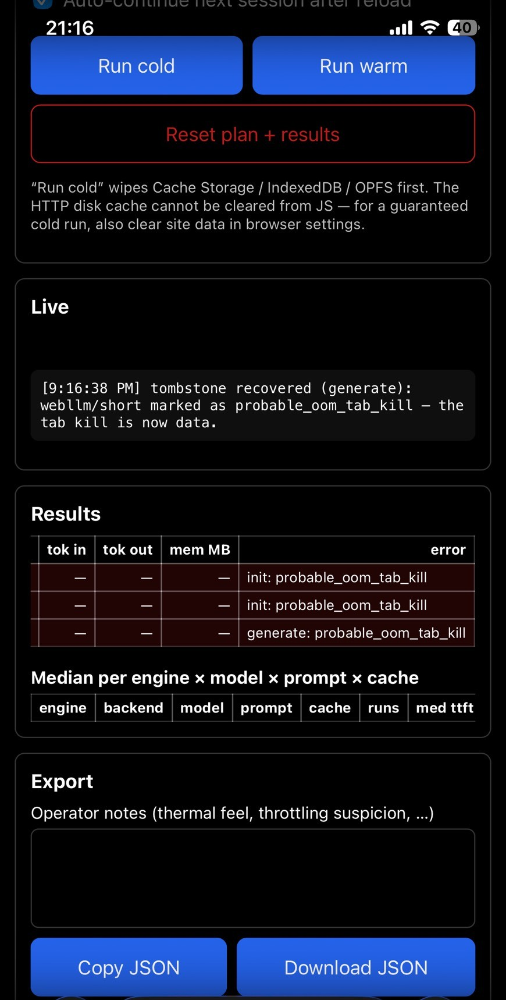

# Browser inference field notes — June 2026

> Measurement report behind [ludion](../../README.md)'s routing policy v0.
> Every number below sits inside a generated block (`<!-- gen:* -->`) computed
> from the archived exports in [`bench/results/`](../../bench/results/) and the
> pinned engine config — regenerated by `pnpm --filter ludion-bench report-data`
> and diff-checked in CI. The prose between blocks is operator narrative.

*June 2026. This report accompanies [Ludion](https://github.com/Ludion-ai/Ludion), a client-side inference router. Every number in the tables below is generated by script from the raw measurement JSONs in [`bench/results/`](../../bench/results/) — nothing is hand-typed, and CI fails if the tables drift from the data. The prose is the story of how we got them.*

## 1. Setup

Three questions, one day, three devices:

1. What do browser inference engines — WebLLM, Transformers.js, wllama — actually deliver on hardware people own?
2. Where, exactly, does on-device inference stop working?
3. Can those boundaries be written down as routing rules?

Method: a self-contained bench page. Fixed prompts (short English, ~52 tokens in; long Japanese context, 1,213 tokens in), one warmup plus three timed runs per configuration, a single shared clock for every engine, and — this turned out to matter more than anything — *tombstones*: a marker written to storage before each risky phase, so that when a browser silently kills the tab, the next page load records the death instead of losing it. On iOS, most of our data is tombstones.

Devices: a desktop with a discrete GPU (Chrome), a Pixel 8a (2024 mid-range Android, Mali-G715), an iPhone 11 Pro Max (2019, 4 GB RAM, iOS 26 — WebGPU newly enabled by Safari 26), and — by accident, see §5 — LINE's in-app browser.

<!-- gen:inventory -->
| archived export | runs | ok | failed | engines | distinct models |
|---|---|---|---|---|---|
| `desktop-chrome-20260610T102824.json` | 36 | 36 | 0 | webllm, transformersjs, wllama | 6 |
| `iphone-11-pro-max-20260610T111359.json` | 2 | 0 | 2 | webllm | 1 |
| `iphone-11-pro-max-20260610T112313.json` | 1 | 0 | 1 | webllm | 1 |
| `iphone-11-pro-max-20260610T121735.json` | 3 | 0 | 3 | wllama, webllm | 2 |
| `pixel-8a-20260610T125416.json` | 6 | 6 | 0 | webllm | 1 |
| `pixel-8a-line-iab-20260610T124347.json` | 0 | 0 | 0 | – | 0 |
| `web-windows-chrome-20260612T134355.json` | 6 | 6 | 0 | webllm | 1 |

**54 runs** total across 7 archived exports (48 successful, 6 failed — failures are routing data, not noise). Full per-group medians: [`bench/results/supplier-table.md`](../../bench/results/supplier-table.md).
<!-- /gen:inventory -->

## 2. Desktop: same model, same GPU, different engine — wildly different speed

The desktop story is not "it works" — everyone knows it works. The story is the spread: **the same model, on the same machine, runs up to 3.7× faster depending on which engine loads it.** That is not a tuning detail; it is the difference between a product that feels instant and one that feels broken.

And the ranking is not even stable. Move from one model to another and the engine order *inverts* — the engine that finished last on Qwen becomes competitive on Llama. There is no "best engine," only best *pairs*, discoverable by measurement and by nothing else.

<!-- gen:desktop-engine-spread -->
Device: `desktop-chrome-20260610T102824.json` — 3 engines × 2 models, WebGPU desktop (adapter: amd rdna-4).

| model | engine | backend | decode tps (short, med) | decode tps (long, med) | ttft ms (short, med) | ttft ms (long, med) |
|---|---|---|---|---|---|---|
| bartowski/Llama-3.2-1B-Instruct-GGUF | wllama | webgpu | 97.6 | 15.9 | 127 | 1196 |
| bartowski/Qwen2.5-1.5B-Instruct-GGUF | wllama | webgpu | 45.3 | 42.5 | 280 | 1488 |
| Llama-3.2-1B-Instruct-q4f16_1-MLC | webllm | webgpu | 196.2 | 112.7 | 44 | 461 |
| onnx-community/Llama-3.2-1B-Instruct-ONNX | transformersjs | webgpu | 125.4 | 128.8 | 67 | 531 |
| onnx-community/Qwen2.5-1.5B-Instruct | transformersjs | webgpu | 33 | – | 136 | 5304 |
| Qwen2.5-1.5B-Instruct-q4f16_1-MLC | webllm | webgpu | 121.5 | 31.1 | 52 | 824 |

- **Llama-3.2-1B**, short prompt, identical hardware: fastest engine (webllm, 196.2 tps) vs slowest (wllama, 97.6 tps) = **2× spread**.
- **Qwen2.5-1.5B**, short prompt, identical hardware: fastest engine (webllm, 121.5 tps) vs slowest (transformersjs, 33 tps) = **3.7× spread**.
<!-- /gen:desktop-engine-spread -->

If you only take one number from this section: an engine choice you didn't measure can silently cost you 3.7× of your users' hardware.

## 3. Pixel 8a: decode looks fine, prefill is the wall

<!-- gen:pixel-8a-prefill -->
Device: `pixel-8a-20260610T125416.json` — Pixel 8a, adapter arm/valhall (Mali), WebLLM Llama-3.2-1B-Instruct-q4f16_1-MLC.

| prompt | tokens_in (med) | prefill tps (med) | decode tps (med) | ttft ms (med) | ttft |
|---|---|---|---|---|---|
| short | 52 | 13.8 | 10.3 | 3782 | 3.8 s |
| long-context | 1213 | 15.8 | 8.8 | 76996 | 77 s |

At a median 1213-token prompt, prefill at 15.8 tps puts time-to-first-token at **77 seconds**. Decode alone (8.8 tps) looks usable; the prefill rate is what makes long context non-viable on this GPU class.
<!-- /gen:pixel-8a-prefill -->

The Pixel 8a is a competent 2024 phone: 8 GB RAM, WebGPU on, f16 supported, 4 GB max buffer size. The capability probe looks great. Then you run it.

Decode: ~10 tokens/sec. Borderline, but readable — a chat works.

Prefill: 13–16 tokens/sec. **Broken.** On a healthy GPU, prefill runs 10–100× faster than decode because it is massively parallel (our desktop did ~2,600 tok/s). On this Mali, the parallel advantage is simply gone — prefill crawls at decode speed. Feed it our 1,213-token Japanese article and the arithmetic is merciless: **77 seconds before the first output token.** Three runs, ±0.4 s. Nobody waits 77 seconds.

The lesson generalizes: **WebGPU gives you functional portability, not performance portability.** Kernels tuned on desktop GPUs fall off a cliff on mobile architectures, and the probe cannot tell you this — only a measurement can. A router reading spec sheets would have routed that article to this phone and shipped a 77-second disaster.

So the routing rule for this device class is shaped like the failure: short prompts locally, anything with real context to the server. The boundary is a *task-shape* boundary, not a device on/off switch.

## 4. iPhone 11 Pro Max: the kill ladder

<!-- gen:iphone-kill-ladder -->
Device: iPhone 11 Pro Max (Safari), 3 archived attempts, **0/6 successful runs**. Adapter `maxBufferSize` = 715827880 bytes ≈ **715.8 MB** — the per-buffer ceiling WebKit grants this device.

| attempt | engine | model | kv ctx in effect | failed stage | error |
|---|---|---|---|---|---|
| 20260610T111359 | webllm | Qwen2.5-1.5B-Instruct-q4f16_1-MLC | – | init | TypeError |
| 20260610T111359 | webllm | Qwen2.5-1.5B-Instruct-q4f16_1-MLC | – | init | TypeError |
| 20260610T112313 | webllm | Llama-3.2-1B-Instruct-q4f16_1-MLC | – | generate | probable_oom_tab_kill |
| 20260610T121735 | wllama | bartowski/Qwen2.5-0.5B-Instruct-GGUF | – | init | probable_oom_tab_kill |
| 20260610T121735 | wllama | bartowski/Qwen2.5-0.5B-Instruct-GGUF | – | init | probable_oom_tab_kill |
| 20260610T121735 | webllm | Llama-3.2-1B-Instruct-q4f16_1-MLC | 2048 | generate | probable_oom_tab_kill |
<!-- /gen:iphone-kill-ladder -->

WebGPU: present. f16: supported. maxBufferSize: 715.8 MB. And every single configuration died:

- 1.5B model — killed during download
- 1B model — killed seconds into generation
- 0.5B model, different engine — killed during init

No crash logs. No console errors. WebKit terminates over-budget tabs *gracefully*: no autopsy, just a reloaded page. Without tombstones, this entire device class would have produced no data at all.

We found two things in the wreckage worth more than the failures themselves:

**1. WebLLM preallocates the entire KV cache at load time.** The prebuilt configs run an effective context window of 4096 unless overridden per-model. Halving it to 2048 saved ~67 MB of the KV budget — real, measurable, and not enough. The 1B model's weights alone are 664 MB against what appears to be a ~700–800 MB effective per-tab budget on a 4 GB device. The lever worked; the gap didn't care.

<!-- gen:webllm-vram -->
Source: `@mlc-ai/web-llm@0.2.84` `prebuiltAppConfig` (pinned; engine self-declared requirements, not measurements).

| model | vram_required_MB | context_window_size |
|---|---|---|
| Qwen2.5-0.5B-Instruct-q4f16_1-MLC | 944.62 | 4096 |
| Llama-3.2-1B-Instruct-q4f16_1-MLC | 879.04 | 4096 |
| Qwen2.5-1.5B-Instruct-q4f16_1-MLC | 1629.75 | 4096 |

Note the inversion: the 0.5B Qwen (944.62 MB) declares **more** VRAM than the 1B Llama (879.04 MB) — vocabulary size, not parameter count, dominates at this scale. Model "size" is not a reliable proxy for memory pressure.
<!-- /gen:webllm-vram -->

**2. The engine's own memory estimates invert.** Per the pinned engine config, the 0.5B model "requires" *more* VRAM than the 1B (944.62 vs 879.04 MB) — vocabulary and embedding overhead dominate at small scales. If we had trusted the engine's self-report to pick a "safer, smaller" model, we would have picked the more dangerous one. **Engine self-reports are not routing data.**

Verdict for the class: server-only — and unlike a guess, we can say precisely why, with the boundary coordinates attached.

### On-device observations (screenshot evidence)

Live-session evidence is archived as screenshots and deliberately kept out of
the generated tables above: the tombstone screen shown in this section
([`assets/bench-iphone-tombstones.jpg`](assets/bench-iphone-tombstones.jpg)),
and the Gate 1 acceptance decision strips at the repository root
([`assets/`](../../assets/), shown in the
[README](../../README.md)). These are **operator-witnessed observations
(実機観測), not generated numbers**.

## 5. LINE in-app browser: the probe that lies by omission

<!-- gen:iab-probe -->
Archived export: `pixel-8a-line-iab-20260610T124347.json` — **0 completed runs** (the session stalled mid-download and never finished; the empty `runs` array *is* the finding).

| probe field | value |
|---|---|
| webgpu | true |
| adapter.vendor / architecture | arm / valhall |
| adapter.f16 | true |
| adapter.maxBufferSize | 4294967292 |
| hw_concurrency | 9 |
| device_memory_gb | 8 |

Operator note from the export: “LINE in-app browser (IAB) on Pixel 8a. Session stalled mid-download and never completed. Sole physical evidence that IABs report webgpu:true with full adapter limits (B-6 correction basis): environment viability cannot be inferred from WebGPU presence. Restored from chat transcript 2026-06-10.”
<!-- /gen:iab-probe -->

A friend helped us test the Pixel — and opened the bench link directly from a LINE chat, which silently runs it inside LINE's in-app browser. The probe reported `webgpu: true`, full adapter limits visible, everything green. The session stalled to death anyway.

**In-app browsers do not hide WebGPU. They just kill you by other means** — suspended tabs, tighter memory ceilings, pauses when the user flips back to the chat. Which yields the uncomfortable conclusion: *environment viability cannot be inferred from capability probing at all.* The probe can be perfect and the environment still lethal.

Our answer is two layered defenses: UA-token detection for the in-app browsers we know (`wv`, `Line/`, `FBAN`, `Instagram`, …), and strike-based self-healing for the ones we don't — one observed death on a device/model pair routes that pair to the server for seven days. The first visit may stall; the second won't.

## 6. What this implies for routing

One day of measurement produced **seven routing dimensions**, none of which is readable from a spec sheet:

1. Engine choice (3.7× spread on identical hardware)
2. Engine × model interaction (rankings invert between models)
3. Model size × device memory budget (the iPhone boundary)
4. Runtime configuration (KV/context budget must be set per device class)
5. Task shape (prompt length × prefill capability — the 77-second rule)
6. Execution environment (in-app browsers defeat capability probes)
7. Engine self-reports (inaccurate enough to invert model-size safety)

This is why Ludion's policy is a **versioned JSON table with a rationale column citing these measurements** — and why the default rule for unknown territory is the server. Routing decisions this conditional cannot live in code or intuition; they have to live in data, where they can be audited, versioned, and replaced as coverage grows.

<!-- gen:policy-table -->
Policy `v0-20260610` (default max_tokens 256). Rules evaluate top-down; first hardware+request match wins. Full rationales live in [`router/src/policy.v0.json`](https://github.com/Ludion-ai/Ludion/blob/main/router/src/policy.v0.json).

| rule | target | hardware condition | request condition | privacy-eligible | rationale (first sentence) |
|---|---|---|---|---|---|
| R1 | server | env=webview-iab | any | no | In-app browsers stall/kill local inference regardless of hardware (LINE IAB, Pixel 8a 2026-06-10). |
| R2 | server | webgpu=false | any | no | No WebGPU → no local path (WebLLM is WebGPU-only). |
| R3 | server | os_class=ios-webkit | any | no | 0 successful iOS rows in Gate 0. |
| R4 | local | os_class=desktop, webgpu=true | est_prompt_tokens ≤ 3000 | yes | Desktop WebGPU: 121-196 tps decode, prefill ~2.6k tps (Gate 0). |
| R5 | local | os_class=android-chromium, webgpu=true | est_prompt_tokens ≤ 200, max_tokens ≤ 256, stream=true | yes | Pixel 8a: decode ~10 tps OK, prefill ~15 tps → long context unusable (77s TTFT @1.2k tok). |
| R6 | server | any | any | no | Default: unknown territory routes safe. |
<!-- /gen:policy-table -->

## 7. Open holes — contribute a row

Honesty section. Coverage is real but thin: **n=1 per device class.** Our entire Android story is one Mali phone — Adreno, which powers most of the world's Androids, is unmeasured and may behave completely differently. No 8 GB-class iPhone. No warm-cache mobile numbers. The 200-token Android boundary is interpolated from two points, not measured at the boundary.

Known holes we would take rows for:

- **Adreno-class Android** (does the prefill wall generalize beyond Mali?)
- **8 GB-RAM iPhones** (does the kill ladder disappear with headroom, or just
  move?)
- **Warm-cache mobile** (all mobile rows above are cold-cache)
- **wllama on Mali** (is the prefill wall WebGPU-specific or device-intrinsic?)

That's not a footnote; it's the invitation. The bench is a static page — if you have ten minutes and a phone we haven't measured:

1. Open the bench, pick a configuration, tap **Run cold**
2. Keep the screen on and the browser foregrounded until it finishes
3. **Download JSON** and open a PR into [`bench/results/`](../../bench/results/) (naming convention: [`bench/results/README.md`](../../bench/results/README.md))

Every row makes the routing table — and therefore every app built on it — smarter. The table is only as good as its coverage. That is the point of it.
